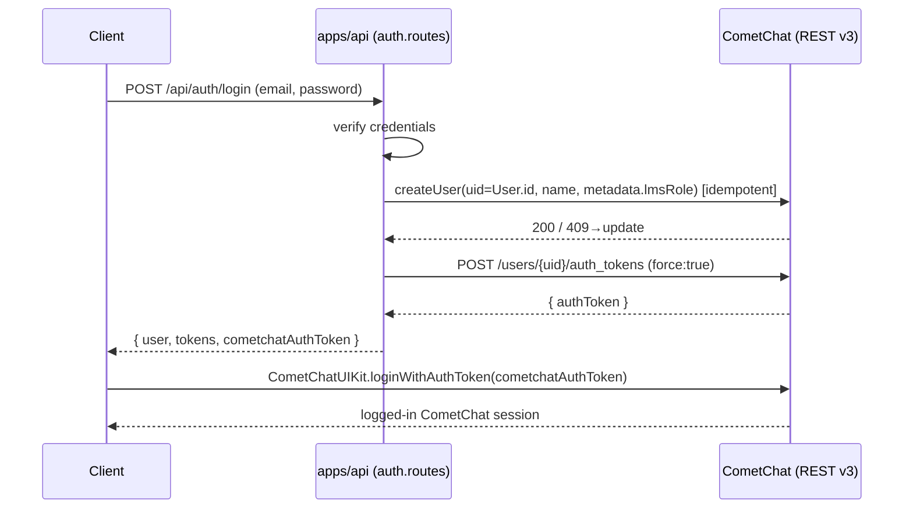

# CometChat Integration (Phase 2)

This document is the canonical reference for how **CometChat** is integrated into
the CometLMS monorepo. It covers the server-side REST service, the web (React) and
mobile (Flutter) UI Kit clients, the user/group identity model, the
dashboard-configured features, and calling.

> **Phase context.** *Phase 1* shipped the LMS with a **custom Socket.IO + WebRTC**
> chat/calls stack. *Phase 2* (this branch, `cometchat`) **replaced** that custom
> stack with **CometChat** across web and mobile. The pre-existing **Firebase Cloud
> Messaging (FCM) push pipeline was deliberately kept** alongside CometChat — the
> core integration goal was *don't break existing workflows*.

**Related docs**

| Doc | What it covers |
|---|---|
| [`COMETCHAT_WEBHOOKS.md`](./COMETCHAT_WEBHOOKS.md) | The one custom webhook (per-course engagement analytics) |
| [`COMETCHAT_SKILLS_USAGE.md`](./COMETCHAT_SKILLS_USAGE.md) | CometChat AI-agent "Skills" used at development time to drive this integration |
| [`../apps/api/COMETCHAT_AI_AGENTS.md`](../apps/api/COMETCHAT_AI_AGENTS.md) | AI Agent Builder setup + the kept FCM push pipeline |
| [`../apps/web/src/cometchat/FEATURES_SETUP.md`](../apps/web/src/cometchat/FEATURES_SETUP.md) | Step-by-step dashboard extension/AI feature enablement |
| [`DATABASE_DESIGN.md`](./DATABASE_DESIGN.md) | `Course.cometchatGroupId`, `CourseEngagementMetrics`, and related schema |

---

## 1. Overview

CometChat provides chat (1-1 and group), reactions/polls/stickers, AI copilots,
moderation, and voice/video calling. It is wired in three layers:

1. **Server (`apps/api`)** — a thin REST client (`cometchat.service.ts`) that
   manages CometChat **users**, **groups**, **memberships**, **auth tokens**, and
   **moderation** using the server-only **REST API Key**. It also mints
   per-user **auth tokens** during login so clients never see the Auth Key.
2. **Web client (`apps/web`)** — the **React UI Kit v6** (`@cometchat/chat-uikit-react`)
   plus the Chat and Calls JavaScript SDKs, initialized once and kept in sync with
   the LMS auth session.
3. **Mobile client (`apps/mobile`)** — the **Flutter UI Kit v6**
   (`cometchat_chat_uikit: 6.0.1`, calls bundled), initialized once at startup.

A single **custom webhook** receives group events for engagement analytics
(documented separately in [`COMETCHAT_WEBHOOKS.md`](./COMETCHAT_WEBHOOKS.md)).
Everything else — AI bot replies, push, profanity/moderation — is handled
**natively by CometChat** (dashboard-configured), not by custom server code.

---

## 2. Architecture

```
┌──────────────────────────────────────────────────────────────────────────┐
│                              CometLMS                                       │
│                                                                            │
│  ┌────────────────────┐         ┌────────────────────┐                     │
│  │  apps/web (React)  │         │ apps/mobile(Flutter)│                    │
│  │  UI Kit v6         │         │  UI Kit v6 (calls   │                    │
│  │  Chat + Calls SDK  │         │  bundled)           │                    │
│  └─────────┬──────────┘         └──────────┬─────────┘                     │
│            │ loginWithAuthToken            │ loginWithAuthToken            │
│            │ (token minted by server)      │                              │
│            ▼                               ▼                              │
│   ┌─────────────────────────────────────────────────────┐                │
│   │                CometChat Cloud (region = in)          │◄────────┐     │
│   │   Users · Groups · Messages · Calls · AI · Moderation │         │     │
│   └───────▲───────────────────────────────────┬──────────┘         │     │
│           │ REST v3 (REST API Key, server-only)│ webhook events     │     │
│           │                                    │ (group only)       │     │
│  ┌────────┴────────────────────────────────────▼───────────────────┴───┐ │
│  │                       apps/api (Express)                              │ │
│  │  cometchat.service.ts  ── createUser/createGroup/addMembers/token... │ │
│  │  auth.routes.ts        ── sync user + mint token on every login       │ │
│  │  course.routes.ts      ── provisionCourseGroup on publish/create      │ │
│  │  cometchat-webhook.ts  ── POST /api/webhooks/cometchat/events         │ │
│  │  moderation-api.routes ── admin proxy for flagged messages            │ │
│  │  (FCM pipeline KEPT)   ── BullMQ → Firebase Admin → FCM               │ │
│  └──────────────────────────────────────────────────────────────────────┘ │
└──────────────────────────────────────────────────────────────────────────┘
```

The **REST API Key is server-only** and never reaches a client. Clients
authenticate with a **server-minted auth token** (production) or, in development,
fall back to Auth-Key login by UID.

---

## 3. Server service — `apps/api/src/services/cometchat.service.ts`

A best-effort REST v3 client. Base URL is derived from the configured App ID and
region:

```
https://{appId}.api-{region}.cometchat.io/v3/
```

Every request sends the `apikey: <REST_API_KEY>` header (server-only). The
service **no-ops when CometChat is not configured** (`isCometChatEnabled()` returns
`false` when App ID / region / REST API Key are not all set), so the LMS keeps
working with chat disabled. Transient and 4xx errors are logged rather than thrown,
except where a caller needs the result (e.g. `createAuthToken`).

### 3.1 Methods

| Area | Method | Notes |
|---|---|---|
| Users | `createUser` | **Idempotent**: `POST /users`; on `409` / `ERR_UID_ALREADY_EXISTS` falls back to `updateUser` (keeps name/avatar in sync). |
| | `updateUser` | `PUT /users/{uid}` — name, avatar, metadata. |
| | `deleteUser` | `DELETE /users/{uid}` (`permanent` flag). |
| | `getUser` | `GET /users/{uid}`. |
| | `getUsersStatus` | `GET /users?uids=…` → `status` ('online'/'offline') per UID. |
| | `createAuthToken` | `POST /users/{uid}/auth_tokens` with `{ force: true }`; returns the token string or `null`. |
| Groups | `createGroup` | **Idempotent**: `POST /groups`; on `409` / `ERR_GUID_ALREADY_EXISTS` falls back to `updateGroup`. |
| | `updateGroup` | `PUT /groups/{guid}` — name, metadata. |
| | `deleteGroup` | `DELETE /groups/{guid}`. |
| | `getGroup` | `GET /groups/{guid}`. |
| Membership | `addGroupMembers` | `POST /groups/{guid}/members`; **buckets members by scope** into `participants` / `moderators` / `admins` arrays. |
| | `removeGroupMember` | `DELETE /groups/{guid}/members/{uid}`. |
| Moderation | `listFlaggedMessages` | `GET /moderation/flagged-messages` (paginated). |
| | `dismissFlaggedMessage` | `PUT /moderation/flagged-messages/{id}` with `{ status: 'approved' }`. |
| | `banUser` | `PUT /users/{uid}` with `{ deactivated: true }`. |

`CometChatScope` is `'admin' | 'moderator' | 'participant'`. The low-level
`request()` is exported as an escape hatch.

### 3.2 Roles live in metadata, not native CometChat roles

CometChat's top-level `role` field requires roles to be pre-defined in the
dashboard, so **the LMS does not use CometChat's native roles or tags**. Instead:

- `buildUserMetadata(role, metadata)` stores the LMS role under the **metadata key
  `lmsRole`** on the CometChat user.
- **Authority** in a course group is expressed through **group member scopes**
  (`admin` / `moderator` / `participant`) via `addGroupMembers`.

> **Honest note:** if you query CometChat for a user's "role" or "tags", you will
> not find the LMS role there. Read `metadata.lmsRole`, and use the group member
> scope for moderation authority.

### 3.3 Course group GUID

```ts
courseGroupGuid(courseId) === `course-${courseId}`
```

This is the single source of truth for a course's CometChat group id and is
re-exported by `course.routes.ts`.

---

## 4. User sync & auth-token minting — `apps/api/src/modules/auth/auth.routes.ts`

Every auth flow keeps CometChat in sync and hands the client a fresh auth token.

- `syncCometChatUser(user)` calls `createUser` (idempotent) with **UID == `User.id`**
  and `role` (→ `metadata.lmsRole`). It is **best-effort and never blocks/fails the
  LMS auth flow**.
- `mintCometChatToken(uid)` calls `createAuthToken` (`force: true`) and returns the
  token (or `null`).

Both run on **`/register`**, **`/login`**, **`/dev-bypass-login`**, and **`/refresh`**,
so the flow covers **both new and pre-existing users** (a user who registered before
the CometChat integration is created in CometChat on their next login). Each response
includes `cometchatAuthToken`:

```jsonc
{
  "success": true,
  "data": {
    "user":  { /* public user, passwordHash stripped */ },
    "tokens": { "accessToken": "…", "refreshToken": "…" },
    "cometchatAuthToken": "…"   // client uses this with loginWithAuthToken()
  }
}
```



---

## 5. Identity mapping

There is **no separate mapping table** — identities are derived deterministically.

| LMS concept | CometChat concept | Rule |
|---|---|---|
| `User.id` | User **UID** | UID **==** `User.id` (1:1, no mapping table). |
| LMS role | User `metadata.lmsRole` | Stored in metadata (not native role/tags). |
| `Course.id` | Group **GUID** | `course-{Course.id}`, persisted in **`Course.cometchatGroupId`** (DB column `chat_room_id`, **unique**). |
| Course instructor | Group **owner / admin** | Set as `owner` on `createGroup` and re-asserted via `addGroupMembers(scope: 'admin')`. |
| Course enrollment | Group **participant** | Added on enroll and on payment completion. |

### 5.1 Course group provisioning — `apps/api/src/modules/courses/course.routes.ts`

`provisionCourseGroup({ id, title, instructorId })` (best-effort, never throws):

1. Ensures the **instructor exists** as a CometChat user (`createGroup` with
   `owner` requires it).
2. `createGroup({ guid: course-{id}, name: title, type: 'public', owner: instructorId, metadata: { lmsCourseId, lmsStatus: 'active' } })`.
3. Belt-and-suspenders: `addGroupMembers(guid, [{ uid: instructorId, scope: 'admin' }])`.

It runs on **course create** and **publish**. On **unpublish/archive**,
`deactivateCourseGroup` flips the group metadata to `lmsStatus: 'archived'`
(non-destructive — chat history is preserved). On **delete**, the group is removed
via `deleteGroup`. `cometchatGroupId` is written into the `Course` row inside the
create/publish transaction.

---

## 6. Web client — `apps/web/src/cometchat/`

**Packages**

| Package | Version |
|---|---|
| `@cometchat/chat-uikit-react` | `^6.5.2` |
| `@cometchat/chat-sdk-javascript` | `^4.1.11` |
| `@cometchat/calls-sdk-javascript` | `^5.0.1` |

**Files**

- **`config.ts`** — reads `VITE_COMETCHAT_APP_ID` / `VITE_COMETCHAT_REGION` /
  `VITE_COMETCHAT_AUTH_KEY`. `isCometChatConfigured()` requires at least App ID +
  region.
- **`init.ts`** — `initCometChat()` builds settings via
  `UIKitSettingsBuilder().setAppId().setRegion().setAuthKey().subscribePresenceForAllUsers().build()`
  then `CometChatUIKit.init(settings)`. Init is idempotent (module-level guards to
  survive React 18 StrictMode double-invoke). `loginToCometChat(uid, authToken?)`
  **prefers `loginWithAuthToken(authToken)`** and **falls back to `login(uid)`**
  (Auth-Key) when no token is present **or** when a single-use token is stale (e.g.
  after a page refresh). Concurrent logins are serialized.
- **`CometChatProvider.tsx`** — initializes the SDK once on mount and keeps the
  CometChat session in sync with the LMS auth session. The token is read from
  `localStorage['cometchatAuthToken']`. It **does not block** the LMS app tree on
  chat login; surfaces consume `useCometChat()` (`isReady` / `isChatLoggedIn` /
  `error`).
- **`features-config.ts`** — env-overridable documentation flags (see §8).

**Chat & call surfaces (`apps/web/src/features/chat/`)**

| Component | Purpose |
|---|---|
| `MessagesPage.tsx` | 1-1 conversations. |
| `CourseDiscussion.tsx` | Group chat per course (`course-{id}`). |
| `OfficeHoursCall.tsx` + `JoinOfficeHoursButton.tsx` | Group **video** office-hours room. |
| `CallButtons.tsx` + `CometChatCallOverlay.tsx` | Outgoing call buttons + incoming-call overlay. |

---

## 7. Mobile client (Flutter) — `apps/mobile/lib/core/cometchat/`

**Package:** `cometchat_chat_uikit: 6.0.1` (UI Kit v6 — **calls are bundled**, so no
separate calls package is needed).

**Files**

- **`cometchat_service.dart`** — singleton. `initialize()` runs **once at startup**:
  `CometChatUIKit.init(...)` with `enableCalls = true`, then **explicitly**
  `CometChatUIKitCalls.init(...)` after the Chat SDK is ready (the dual-SDK init
  contract). Auth: `loginWithAuthToken(token)` (production) and `loginWithUid(uid)`
  (dev), plus `logout()`.
- **`cometchat_config.dart`** — App ID / region / auth key.
- **`cometchat_theme.dart`** — theme tokens (explicitly follows the
  `cometchat-flutter-v6-core` skill, cited by name in the file).

Calls require an app-root navigator key:
`MaterialApp(navigatorKey: CallNavigationContext.navigatorKey)` is wired in
`apps/mobile/lib/core/router/app_router.dart` — a Flutter v6 calls requirement
(see [`COMETCHAT_SKILLS_USAGE.md`](./COMETCHAT_SKILLS_USAGE.md)).

**Screens (`apps/mobile/lib/features/chat/screens/`)**

| Screen | Purpose |
|---|---|
| `conversations_screen.dart` | Conversation list. |
| `messages_screen.dart` | 1-1 / thread messages. |
| `course_discussion_screen.dart` | Course group discussion. |

---

## 8. Dashboard-configured features

These are enabled in the **CometChat Dashboard** and **auto-rendered by UI Kit v6**
at runtime (the kit detects enabled extensions and shows the corresponding UI). The
web `features-config.ts` holds **env-overridable flags purely for documentation /
conditional UI** — it does not enable the features (the dashboard does). See
[`FEATURES_SETUP.md`](../apps/web/src/cometchat/FEATURES_SETUP.md) for step-by-step
enablement.

**Extensions**

| Feature | Notes |
|---|---|
| Reactions | Emoji reactions on messages. |
| Polls | Polls in group discussions. |
| Stickers | Sticker packs in the composer. |
| Rich Text / Formatted Messages | Bold/italic/code; composer auto-shows the toolbar. |
| Message Translation | Auto-translate to reader's language. |
| Link Preview | URL unfurling. |
| Profanity Filter / Data Masking | Masks profane words. |
| Content Moderation (**Flag** mode) | Auto-flags inappropriate content for admin review; not "Block". Flagged items are reviewed via the admin moderation proxy. |

**AI features** (CometChat AI section + LLM key in dashboard)

| Feature | Notes |
|---|---|
| Smart Replies | Suggested quick replies as chips. |
| Conversation Starter | Suggested first message for empty conversations. |
| Conversation Summary | Summarizes long threads. |

> AI **bot replies** (FAQ Bot, Study Assistant, Instructor Copilot) are handled by
> CometChat's **AI Agent Builder** — see
> [`COMETCHAT_AI_AGENTS.md`](../apps/api/COMETCHAT_AI_AGENTS.md). No custom server
> relay is involved.

---

## 9. Calling

- **1-1 and group voice/video** use the CometChat **Calls SDK** (bundled into the
  Flutter UI Kit v6; a separate `@cometchat/calls-sdk-javascript@^5` on web).
- **Office hours** is a **group video room** rendered by `OfficeHoursCall.tsx` /
  joined via `JoinOfficeHoursButton.tsx` on web.
- On web, `CallButtons.tsx` initiates calls and `CometChatCallOverlay.tsx` surfaces
  incoming calls. On Flutter, the `CallNavigationContext.navigatorKey` wiring lets
  call screens present from anywhere.

---

## 10. Admin moderation proxy — `apps/api/src/modules/chat/moderation-api.routes.ts`

So the admin dashboard never hits CometChat directly (keeping the REST API Key
server-side), the API exposes an **admin-only** proxy mounted at
`/api/admin/moderation` (requires `ADMIN` / `SUPER_ADMIN`):

| Route | Action |
|---|---|
| `GET /api/admin/moderation` | List flagged messages (`page`, `limit` forwarded). |
| `POST /api/admin/moderation/:id/dismiss` | Approve/dismiss a flagged message. |
| `POST /api/admin/moderation/:id/ban` | Dismiss the flag, then `banUser(uid)` (deactivate). Body: `{ uid }`. |

All routes return `503` when CometChat is not configured.

---

## 11. Environment variables

> **Never commit real values.** Placeholders below; the region code for this app is
> **`in`**. App IDs are non-secret identifiers (format: a hex-ish string).

### API (`apps/api/.env`) — server

| Variable | Purpose | Secret? |
|---|---|---|
| `COMETCHAT_APP_ID` | `<COMETCHAT_APP_ID>` — app identifier | No |
| `COMETCHAT_REGION` | `<REGION>` (= `in`) | No |
| `COMETCHAT_AUTH_KEY` | `<AUTH_KEY>` — used for dev-fallback login only | Yes |
| `COMETCHAT_REST_API_KEY` | `<REST_API_KEY>` — **server-only**, never sent to client | **Yes** |
| `COMETCHAT_WEBHOOK_SECRET` | `<WEBHOOK_SECRET>` — HMAC verify (see webhooks doc) | **Yes** |

### Web (`apps/web/.env`) — client (all public)

| Variable | Purpose |
|---|---|
| `VITE_COMETCHAT_APP_ID` | `<COMETCHAT_APP_ID>` |
| `VITE_COMETCHAT_REGION` | `<REGION>` (= `in`) |
| `VITE_COMETCHAT_AUTH_KEY` | `<AUTH_KEY>` — dev-fallback login only |

Optional `VITE_COMETCHAT_FEATURES_*` flags mirror §8 (all default `true` except the
optional collaborative doc/whiteboard). See `features-config.ts`.

---

## 12. What changed vs Phase 1

| Phase 1 (custom) | Phase 2 (CometChat) |
|---|---|
| Custom **Socket.IO** real-time chat | CometChat messaging via UI Kit v6 (web + Flutter). |
| Custom **WebRTC** calls | CometChat Calls SDK (1-1 + group video/voice). |
| Hand-rolled chat UI | CometChat UI Kit v6 components. |
| Custom Groq-powered AI bots + relay webhook | CometChat **AI Agent Builder** (dashboard). |
| — | **One** custom webhook kept for **engagement analytics** only. |
| **FCM push pipeline** | **Kept unchanged** alongside CometChat (BullMQ → Firebase Admin → FCM). |

The custom Socket.IO/WebRTC stack was removed; the FCM push pipeline was preserved
so existing notification content/routing keeps working.

---

## 13. Known limitations & notes

- **No CometChat native roles/tags.** LMS role is in `metadata.lmsRole`; authority is
  expressed via group member scopes. Don't expect roles/tags on the CometChat side.
- **Dev fallback UID login uses the Auth Key.** `login(uid)` (web) / `loginWithUid`
  (mobile) is a development convenience and is **not for production** — production
  uses server-minted auth tokens.
- **Auth tokens are single-use.** A stale token (e.g. after refresh) is expected to
  fail; the client falls back to UID login in dev. In production, mint a fresh token
  via `/refresh`.
- **Region code is `in`.** Base URLs and client config must use `in`.
- **No-op when unconfigured.** If any of App ID / region / REST API Key is missing,
  server-side CometChat calls silently no-op so the LMS still runs.
