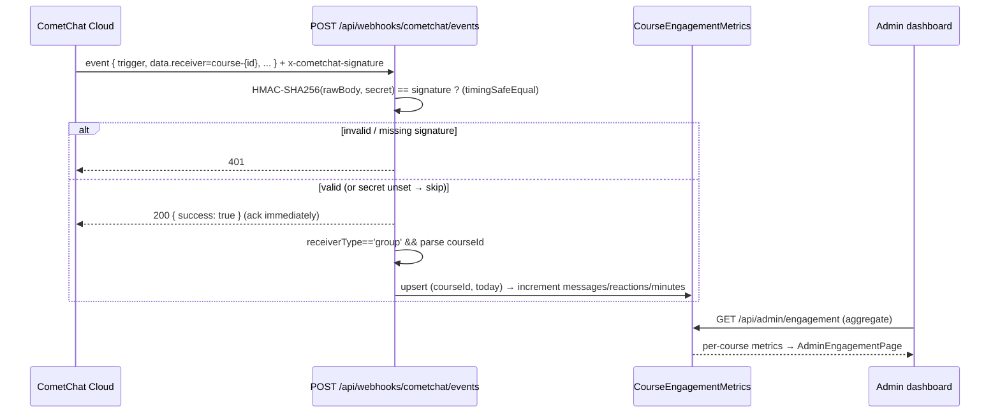

# CometChat Webhooks — Course Engagement Analytics

This document describes the **one custom webhook** CometLMS maintains, defined in
[`apps/api/src/modules/chat/cometchat-webhook.ts`](../apps/api/src/modules/chat/cometchat-webhook.ts).

> **One use case only.** This webhook exists for **per-course engagement
> analytics** — counting messages, reactions, and call-minutes per course per day.
> CometChat does not aggregate at the course-group level, so the server does it.
> **Everything else is CometChat-native** (AI replies via Agent Builder, push,
> profanity filter, moderation) and requires **no custom webhook**. See
> [`COMETCHAT_INTEGRATION.md`](./COMETCHAT_INTEGRATION.md) and
> [`../apps/api/COMETCHAT_AI_AGENTS.md`](../apps/api/COMETCHAT_AI_AGENTS.md).

**Related docs**

| Doc | Relevance |
|---|---|
| [`COMETCHAT_INTEGRATION.md`](./COMETCHAT_INTEGRATION.md) | Group GUID format `course-{id}`, identity model |
| [`DATABASE_DESIGN.md`](./DATABASE_DESIGN.md) | `CourseEngagementMetrics` table |
| [`../apps/api/COMETCHAT_AI_AGENTS.md`](../apps/api/COMETCHAT_AI_AGENTS.md) | Why other capabilities need no custom webhook |

---

## 1. Endpoint

```
POST /api/webhooks/cometchat/events
```

Mounted in `apps/api/src/server.ts`. The raw request body is captured into
`req.rawBody` (via an `express.json` `verify` hook) **before** JSON parsing so the
HMAC can be computed over the exact bytes CometChat signed.

---

## 2. Security (HMAC-SHA256)

1. If `COMETCHAT_WEBHOOK_SECRET` is **set**, the handler:
   - Requires the **`x-cometchat-signature`** header (else `401 Missing signature`).
   - Requires `req.rawBody` to be present (else `500` configuration error).
   - Computes `HMAC-SHA256(rawBody, secret)` as hex and compares it to the header
     using **`crypto.timingSafeEqual`** (constant-time). Mismatch → `401 Invalid
     signature`.
2. If `COMETCHAT_WEBHOOK_SECRET` is **not set**, the handler logs a **warning and
   skips verification**.

> ⚠️ **Setup requirement.** Skipping verification is a development convenience only.
> **Always set `COMETCHAT_WEBHOOK_SECRET`** in any shared/production environment,
> and configure the same secret in the CometChat Dashboard. An unsigned endpoint
> can be spammed with fake engagement events.

After verification, the handler **responds `200 { success: true }` immediately** and
then processes the event **asynchronously** — so CometChat does not retry, and slow
DB work never delays the acknowledgement.

```ts
// Constant-time HMAC comparison (cometchat-webhook.ts)
const expected = crypto.createHmac('sha256', secret).update(rawBody).digest('hex');
crypto.timingSafeEqual(Buffer.from(signature, 'hex'), Buffer.from(expected, 'hex'));
```

---

## 3. Events handled

Only events where **`data.receiverType === 'group'`** are processed, and the group
receiver must match `course-{courseId}` (the GUID is parsed back into a `courseId`;
non-course groups are ignored). The handler tolerates several trigger-name spellings
CometChat may send.

| Logical event | Accepted `trigger` values | Effect on `CourseEngagementMetrics` |
|---|---|---|
| Message sent | `on_message_sent`, `message_new`, `message.new` | `totalMessages += 1` |
| Reaction added | `on_message_reaction_added`, `message_reaction_added`, `message.reaction_added` | `totalReactions += 1` |
| Call ended | `on_call_ended`, `call_ended`, `call.ended` | `callMinutes += ceil(data.duration / 60)` (only if > 0) |

`data.duration` is in **seconds**; minutes are **rounded up** with `Math.ceil`.

---

## 4. Persistence — `CourseEngagementMetrics`

Each event performs an **upsert keyed by `(courseId, date)`** (today's UTC date,
time zeroed for the `@db.Date` column), incrementing the relevant counter. The model
(see [`DATABASE_DESIGN.md`](./DATABASE_DESIGN.md)):

| Column (DB name) | Written by this webhook? |
|---|---|
| `totalMessages` (`total_messages`) | ✅ incremented on message events |
| `totalReactions` (`total_reactions`) | ✅ incremented on reaction events |
| `callMinutes` (`call_minutes`) | ✅ incremented on call-ended events |
| `activeChatters` (`active_chatters`) | ⚠️ created as `0`, **never updated** |
| `flaggedMessages` (`flagged_messages`) | ⚠️ created as `0`, **never updated** |
| `resolvedFlags` (`resolved_flags`) | ⚠️ created as `0`, **never updated** |

Uniqueness is enforced by `@@unique([courseId, date])` (the upsert's
`courseId_date` compound key).

> **Known limitation / future work.** `activeChatters`, `flaggedMessages`, and
> `resolvedFlags` columns exist but are **currently always `0`** — the webhook does
> not yet populate them (e.g. distinct-sender tracking, or wiring moderation
> flag/resolve events into these counters). Treat them as reserved.



---

## 5. Visibility in the admin dashboard

The persisted metrics surface in the admin UI:

| API | Web | What it shows |
|---|---|---|
| `GET /api/admin/engagement` | `AdminEngagementPage.tsx` (route `/admin/engagement`) | Per-course engagement aggregation. |
| `GET /api/admin/stats` | Admin overview | Feeds `messagesToday` (sum of `totalMessages`) and a derived `engagementScore`. |
| `GET /api/admin/events/log` | `ActivityLog` component on `/admin` | Recent activity feed (polled). |

These live in `apps/api/src/modules/admin/admin.routes.ts` and
`apps/web/src/features/admin/`.

---

## 6. Dashboard setup

In the **CometChat Dashboard → Webhooks**:

1. **URL:** `https://<your-domain>/api/webhooks/cometchat/events`
2. **Triggers:** enable `message_new` (or `on_message_sent`),
   `message_reaction_added` (or `on_message_reaction_added`), and `call_ended`
   (or `on_call_ended`).
3. **Security:** enable **HMAC-SHA256** signing and set a secret.
4. Put the **same secret** in the API `.env` as `COMETCHAT_WEBHOOK_SECRET`
   (placeholder: `<WEBHOOK_SECRET>`).

> Some older notes reference `/api/webhooks/cometchat` and message edit/delete
> triggers — the **current, mounted** path is `/api/webhooks/cometchat/events` and
> the handler only acts on **message-sent / reaction-added / call-ended** for
> **group** receivers.

---

## 7. Example payload

A message-sent event in a course group (`course-abc123`):

```json
{
  "trigger": "message_new",
  "data": {
    "receiver": "course-abc123",
    "receiverType": "group",
    "sender": "user-42",
    "category": "message",
    "type": "text"
  }
}
```

A call-ended event (duration in **seconds**):

```json
{
  "trigger": "call_ended",
  "data": {
    "receiver": "course-abc123",
    "receiverType": "group",
    "duration": 185
  }
}
```

`185s → Math.ceil(185 / 60) = 4` → `callMinutes += 4`.

---

## 8. Verifying a signed request (local test)

Compute the same HMAC the server expects, then POST with the header:

```bash
SECRET='<WEBHOOK_SECRET>'
BODY='{"trigger":"message_new","data":{"receiver":"course-abc123","receiverType":"group"}}'
SIG=$(printf '%s' "$BODY" | openssl dgst -sha256 -hmac "$SECRET" | sed 's/^.* //')

curl -sS -X POST http://localhost:3000/api/webhooks/cometchat/events \
  -H 'content-type: application/json' \
  -H "x-cometchat-signature: $SIG" \
  --data "$BODY"
# → 200 {"success":true}
```

> The signature must be over the **exact raw bytes** of the request body — do not
> reformat/prettify `BODY` between signing and sending, or the HMAC will not match
> (the server compares against `req.rawBody`).

---

## 9. Why this is the only custom webhook

| Capability | Handled by | Custom webhook needed? |
|---|---|---|
| Engagement analytics (this doc) | Custom server webhook | ✅ Yes |
| AI bot replies | CometChat AI Agent Builder | ❌ No |
| Push notifications | CometChat native **and/or** the kept FCM pipeline | ❌ No |
| Profanity filter / data masking | CometChat moderation rules | ❌ No |
| Content moderation (flagging) | CometChat moderation; reviewed via `/api/admin/moderation` proxy | ❌ No (admin proxy is REST, not a webhook) |

See [`../apps/api/COMETCHAT_AI_AGENTS.md`](../apps/api/COMETCHAT_AI_AGENTS.md) for the
native capabilities and the FCM push pipeline that was kept.
